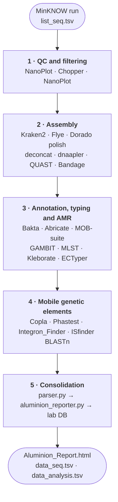

# Aluminion

**Automated pipeline for bacterial whole-genome sequencing from Oxford Nanopore reads.**

Aluminion takes raw `fastq_pass` reads from a MinKNOW run and produces polished
assemblies, taxonomic classification, AMR profiles, mobile-genetic-element
detection (plasmids, integrons, prophages, IS elements), an interactive HTML
report, and two **cumulative lab databases** that grow across sequencing runs.

Target organisms: Enterobacteriaceae. The assembly, AMR, and annotation modules
also work on any bacterial species with a published MLST scheme.

---

## Pipeline overview



| Stage | Tools                                                            | Conda env(s)                                |
|------:|------------------------------------------------------------------|---------------------------------------------|
| 1     | NanoPlot, Chopper                                                | `aluminion_reads`                           |
| 2     | Kraken2, Flye, Dorado polish, deconcat, dnaapler, QUAST, Bandage | `aluminion_assembly`, `aluminion_circlator` |
| 3     | Bakta, Abricate, MOB-suite, GAMBIT, MLST, Kleborate, ECTyper     | `aluminion_annot`, `aluminion_kleborate`    |
| 4     | Copla, Phastest, Integron_Finder, ISfinder BLASTn                | `aluminion_annot`, `aluminion_integron`     |
| 5     | parser.py, aluminion_reporter.py, Datos_seq_unified2.py          | `aluminion_annot`                           |

---

## System requirements

| Resource | Minimum               | Recommended                                  |
|----------|-----------------------|----------------------------------------------|
| OS       | Linux (Ubuntu 20.04+) | Ubuntu 22.04 LTS                             |
| CPU      | 16 cores              | 32+ cores                                    |
| RAM      | 64 GB                 | 128 GB (allows the Kraken2 DB in `/dev/shm`) |
| Disk     | 500 GB free           | 1 TB+ free                                   |
| GPU      | —                     | NVIDIA GPU ≥16 GB VRAM (for Dorado polish)   |

macOS is not supported (Docker networking requirements for Phastest).
Windows is community-tested via WSL2 but not officially supported.

---

## Installation

### Automated installer (recommended)

```bash
git clone https://github.com/Aluminio-visto/aluminion.git
cd aluminion
chmod +x aluminion.sh install.sh
./install.sh -b /path/to/Databases
```

`install.sh` creates the conda environments, pulls the Docker images, optionally
downloads the databases, and installs the `aluminion` command in `~/.local/bin`.

| Flag           | Effect                          |
|----------------|---------------------------------|
| `--skip-envs`  | Skip conda environment creation |
| `--skip-docker`| Skip Docker image pulls         |
| `--skip-dbs`   | Skip database downloads         |

### Manual installation

```bash
# 1 · Clone
git clone https://github.com/Aluminio-visto/aluminion.git
cd aluminion
chmod +x aluminion.sh

# 2 · Install Mambaforge (skip if already present)
wget https://github.com/conda-forge/miniforge/releases/latest/download/Mambaforge-Linux-x86_64.sh
bash Mambaforge-Linux-x86_64.sh

# 3 · Create the six conda environments
for env in reads assembly circlator annot integron kleborate; do
    mamba env create -f envs/aluminion_${env}.yml
done

# 4 · Install Docker (required for MOB-suite, Copla, Phastest)
sudo apt-get install -y docker.io docker-compose-plugin
sudo usermod -aG docker $USER && newgrp docker

# 5 · Pull Docker images
docker pull kbessonov/mob_suite:3.0.3
docker pull rpalcab/copla:1.0
```

**Dorado** is a proprietary basecaller / polisher from ONT. Download the latest
Linux binary from <https://github.com/nanoporetech/dorado/releases> and place it
in your `PATH`. GPU polishing requires NVIDIA drivers and CUDA ≥12.

**Phastest** has no public Docker image. Follow <https://phastest.ca> to set up
the local docker-compose, then point Aluminion to it with
`export ALUMINION_PHASTEST_DIR=/path/to/phastest-docker`.

---

## Database setup

All databases live under a single root directory (passed with `-b`).

| Database         | Path                                | Size    | Source                                                            |
|------------------|-------------------------------------|---------|-------------------------------------------------------------------|
| Kraken2 standard | `<db>/Kraken/`                      | ~100 GB | <https://genome-idx.s3.amazonaws.com/kraken/>                     |
| GAMBIT           | `<db>/gambit/`                      | ~1 GB   | <https://github.com/jlumpe/gambit>                                |
| Bakta            | `<db>/bakta/db/`                    | ~30 GB  | `bakta_db download --output <db>/bakta --type full`               |
| ISfinder         | `<db>/ISfinder/ISfinder-nucl.fasta` | ~5 MB   | <https://www.is-finder.org/download.html>                         |
| Abricate         | (auto, in `aluminion_annot`)        | ~150 MB | `abricate-get_db --db {ncbi,resfinder,card,argannot,vfdb}`        |
| MLST (PubMLST)   | (auto, on first run)                | ~10 MB  | downloaded by the `mlst` tool itself                              |

> With less than 128 GB of RAM, comment out the `/dev/shm` copy in
> `aluminion.sh` and point `--db` directly to disk.

---

## Input files

### `list_seq.tsv` — per-run sample sheet

Tab-separated, six columns. Keep it in the **parent working directory** (`-d`)
and pass it with `-l`. Aluminion copies it into the run subfolder at startup.

| Column        | Description                                                       |
|---------------|-------------------------------------------------------------------|
| `Lab_id`      | Internal lab culture ID                                           |
| `Strain`      | Strain collection code                                            |
| `ID`          | **Unique sample identifier — used as the sample name throughout** |
| `Barcode`     | Barcode number assigned by MinKNOW (`01`, `24`, …)                |
| `DNA_conc`    | DNA concentration (ng/µL), informational                          |
| `is_repeated` | `x` if this is a re-sequencing of a previously failed sample      |

See `examples/list_seq.tsv` for a complete example.

### MinKNOW outputs (copied automatically)

| File                  | Purpose                                              |
|-----------------------|------------------------------------------------------|
| `fastq_pass/`         | Demultiplexed FASTQ reads, one folder per barcode    |
| `final_summary_*.txt` | Run summary (instrument, flow cell, dates, duration) |
| `report_*.json`       | JSON report (pore counts, yield)                     |

Override the MinKNOW data path with `-m` or `$ALUMINION_MINKNOW_DIR`.

### Cumulative lab databases (auto-created on first run)

| File                | Purpose                                                        |
|---------------------|----------------------------------------------------------------|
| `data_seq.tsv`      | Sequencing QC, flow cell metadata, depth per sample (all runs) |
| `data_analysis.tsv` | Taxonomy, AMR, MGE counts per sample (all runs)                |

These are updated automatically at the end of each run. The first time, they
are created from scratch — no manual setup needed. `--init-db` forces a rebuild.

---

## Usage

### Directory layout

```
/home/user/Seqs/Servicio/      ← parent working directory (-d)
├── list_seq.tsv               ← fill this before each run
├── data_seq.tsv               ← cumulative sequencing database
├── data_analysis.tsv          ← cumulative analysis database
├── BAC_2025_NOV_25/           ← run folder, created automatically
│   ├── 01_reads/  02_filter/
│   ├── 03_assemblies/
│   ├── 04_taxonomies/  05_plasmids/
│   ├── 08_Anotacion/  09_phages/  11_integrons/
│   ├── Aluminion_Report.html
│   └── aluminion_YYYYMMDD_HHMMSS.log
└── BAC_2026_FEB_10/
    └── …
```

### Standard run

```bash
cd /home/user/Seqs/Servicio
aluminion -r BAC_2025_NOV_25 -b /path/to/Databases -t 30 -l list_seq.tsv
```

A timestamped log is written inside the run folder.

### Flags

| Flag                     | Description                                                                 | Default                       |
|--------------------------|-----------------------------------------------------------------------------|-------------------------------|
| `-r / --run`             | MinKNOW run folder name **(mandatory)**                                     | —                             |
| `-b / --db-dir`          | Path to databases root                                                      | `/home/usuario/Databases`     |
| `-t / --threads`         | CPU threads                                                                 | `30`                          |
| `-l / --list`            | Path to `list_seq.tsv`                                                      | —                             |
| `-d / --dir`             | Parent working directory                                                    | `/home/usuario/Seqs/Servicio` |
| `-p / --phastest-dir`    | Local Phastest docker-compose folder                                        | `~/Programs/phastest-docker`  |
| `-m / --minknow-dir`     | MinKNOW data root                                                           | `/var/lib/minknow/data`       |
| `--init-db`              | Create `data_seq.tsv` / `data_analysis.tsv` from scratch                    | —                             |
| `--resume`               | Resume an interrupted run; skip any step whose output already exists        | —                             |
| `--polish-batchsize <N>` | Override `dorado polish --batchsize` (lower it on `CUDA out of memory`)     | dorado default                |
| `--skip-preprocessing`   | Skip NanoPlot + Chopper (reuse existing `01_reads/`, `02_filter/`)          | —                             |
| `--skip-kraken`          | Skip Kraken2 read-level classification                                      | —                             |
| `--skip-abr`             | Skip Abricate AMR gene screen                                               | —                             |
| `--skip-typing`          | Skip GAMBIT, MLST, Kleborate, ECTyper                                       | —                             |
| `--skip-integrons`       | Skip Integron_Finder                                                        | —                             |
| `--skip-plasmids`        | Skip Copla plasmid typing (MOB-suite always runs)                           | —                             |
| `--skip-phages`          | Skip Phastest prophage detection                                            | —                             |
| `--just-preprocessing`   | Stop after Stage 1. Output: `02_filter/<sample>.fastq.gz`                   | —                             |
| `--just-assembly`        | Stop after Stage 2. Output: `03_assemblies/<sample>.fasta`                  | —                             |
| `-h / --help`            | Show help and exit                                                          | —                             |

### Resuming an interrupted run

```bash
aluminion -r BAC_2025_NOV_25 -b /path/to/Databases -l list_seq.tsv --resume
```

`--resume` checks every step's expected output and silently skips completed
work. It can be combined with any `--skip-*` flag.

### Running only the consolidation stage

If assemblies and annotations are already complete, run the Python parsers
directly:

```bash
conda activate aluminion_annot
python3 scripts/parser.py -i /path/to/run/
python3 scripts/aluminion_reporter.py /path/to/run/
python3 scripts/Datos_seq_unified2.py --input_path /path/to/run/
```

`parser.py` performs a preflight check at startup and lists any missing input
files with the corresponding `--skip-*` flag to bypass them.

### Assembly failure handling

If Flye fails to assemble a sample, Aluminion pauses and offers three choices:

| Choice | Effect                                                               |
|:------:|----------------------------------------------------------------------|
|  `1`   | Skip the sample. The rest of the run continues normally.             |
|  `2`   | Retry with `--meta` (tolerates uneven coverage, high-copy plasmids). |
|  `3`   | Stop the pipeline for manual inspection.                             |

Samples skipped here are removed from the internal `samples` tracking file,
so every downstream module (polishing, Bakta, Kleborate, …) ignores them
automatically.

Optional refinement steps (polishing, deconcat, dnaapler, Bandage, the typing
tools) are **non-fatal**: a failure only emits a warning. The assembly is kept
as-is and the run continues. A consolidated warning summary is printed at the
end listing every sample / tool that failed.

---

## Outputs

| File                     | Description                                                         |
|--------------------------|---------------------------------------------------------------------|
| `Aluminion_Report.html`  | **Interactive HTML report — open in any browser, no server needed** |
| `taxonomy.csv` / `.xlsx` | Kraken2 + GAMBIT + Kleborate + ECTyper + MLST per sample            |
| `AbR_modif.xlsx`         | Abricate AMR genes per sample                                       |
| `mlst_modif.csv`         | MLST scheme, ST, and allele calls                                   |
| `kraken_mlst.xlsx`       | Merged Kraken2 + MLST quick-reference                               |
| `copla_modif.csv`        | Copla plasmid typing (PTU, MOB, Rep, AMR per plasmid)               |
| `integron_summary.csv`   | Integron_Finder results with cassette gene annotations              |
| `phage_summary.csv`      | Phastest prophage regions with completeness scores                  |
| `kleborate.tsv`          | Full Kleborate output (Enterobacterales loci)                       |
| `data_seq.tsv`           | Updated cumulative sequencing database                              |
| `data_analysis.tsv`      | Updated cumulative analysis database                                |

`data_seq_new.tsv` and `data_analysis_new.tsv` are written instead when the
historical databases already exist, so changes can be reviewed before
overwriting the main files.

---

## Repository structure

```
aluminion/
├── aluminion.sh           # Main pipeline orchestrator
├── install.sh             # Automated installer
├── scripts/               # Python parsers and reporters
├── envs/                  # Six conda environment YAMLs
├── examples/              # Example input / output files
└── tests/                 # Automated tests
```

---

## Tests

```bash
python -m pytest tests/test_parser.py -v
```

The suite uses the example files in `examples/` and covers clean exit, row
counts, duplicate detection, AMR gene presence (OXA-48, VIM-1, KPC-2), and HTML
report content. No bioinformatics tools required.

---

## Troubleshooting

**`dorado not found in PATH`** — Install Dorado manually from
<https://github.com/nanoporetech/dorado/releases>.

**`Docker not found`** — `sudo systemctl start docker` and confirm your user is
in the `docker` group.

**Kraken2 runs out of memory** — Your system has less RAM than the database.
Comment out the `/dev/shm` copy in `aluminion.sh` and point `--db` directly to
disk.

**Phastest produces no output** — Verify `$ALUMINION_PHASTEST_DIR` contains
`docker-compose.yml`, `phastest_inputs/`, and `phastest-app-docker/`.

**`parser.py` reports missing files** — The preflight check lists each missing
file and the matching `--skip-*` flag to bypass it.

**Flye `ERROR: No disjointigs were assembled`** — Sample has very high-copy
elements (large plasmids, expression vectors). Choose `2` in the interactive
menu to retry with `--meta`.

**`Failed to initialize NVML: Driver/library version mismatch`** — The running
NVIDIA kernel module no longer matches the user-space library after an
unattended driver upgrade. Reboot, or reload the modules:

```bash
sudo rmmod nvidia_uvm nvidia_drm nvidia_modeset nvidia
sudo modprobe nvidia
nvidia-smi
```

**`CUDA out of memory` during `dorado polish`** — Lower the inference batch
size with `--polish-batchsize 8` (or `4`). Polishing is non-fatal: the
unpolished assembly is kept and the sample is listed in the final warning
summary.

**`list_seq.tsv` not found** — You probably passed a relative path while
running from inside a subfolder. Either `cd` to the parent directory or pass
an absolute path with `-l`.

---

## Contributing

Issues and pull requests welcome. The pipeline is optimised for
Enterobacteriaceae (*Klebsiella*, *Escherichia*, *Enterobacter*,
*Citrobacter*, …) but the assembly, AMR, and annotation modules work for any
bacterial species with a published MLST scheme.
